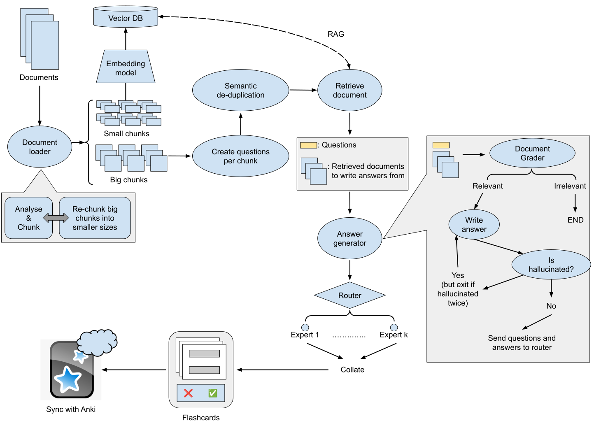

<div align="center">
  

  # FLASH - Flashcard Leveraging Agentic Study Help
</div>

## 📚 About FLASH

FLASH is an application that automatically generates Anki Flashcards from your Notes, Lecture Slides, or Papers (in .pdf format). It integrates seamlessly with Anki and saves the cards directly into your Anki storage. It even syncs automatically if you have syncing set up!

## 🚀 Getting Started

### Prerequisites

1. Download and install [Anki](https://apps.ankiweb.net/)

### Installation

**Requirements**: OpenAI API key

#### Option 1: Windows Executable

[](https://github.com/shoshinL/FLASH/releases/latest)

**Quick Download**: [📦 FLASH-for-Anki-v0.1.0-alpha.1.exe](https://github.com/shoshinL/FLASH/releases/download/v0.1.0-alpha.1/FLASH-for-Anki-v0.1.0-alpha.1.exe)

**Note:** Windows Defender might try to delete and claim it's a trojan. This happens because it was generated using PyInstaller without a signed certificate.

Packaged MacOS App is WIP.

#### Option 2: Build from Source

1. Clone the repository
2. Run the following commands:
Windows:
```shell
python -m venv venv
.\venv\Scripts\activate
pip install -r requirements.txt
```
Unix:
```shell
python -m venv venv
source venv/bin/activate
pip install -r requirements.txt
```

```shell
npm run init
```

Either 
```shell
npm run start
```
or, if you want to create your own packaged version

```shell
npm run build
```

**Note:** If any dependency issues arise please refer to the [pywebview documentation](https://pywebview.flowrl.com/guide/installation.html#dependencies)
## 📖 Usage
1. **Setup**: Enter your OpenAI API key in Settings
2. **Select Deck**: Choose which Anki deck to save flashcards to
3. **Upload PDF**: Select your PDF file (notes, slides, or papers)
4. **Add Instructions**: Provide context for card generation (optional)
5. **Generate**: Click "Generate" and let FLASH create your flashcards!

The generated cards will be saved directly to your selected Anki deck and sync automatically if Ankiweb syncing is enabled in Anki.

## ✨ Features
- 📄 Supports PDF documents (notes, slides, papers)
- 🤖 AI-powered card generation with advanced RAG
- 🎯 Multiple flashcard types (Basic, Cloze, Type-in, etc.)
- 🔄 Direct Anki integration with auto-sync
- ⚡ Parallel processing for faster generation


## 🔧 How It Works

FLASH processes documents through the following steps:



1. **Document Processing**
   - Reads and splits the document into small (for answer generation) and large (for question generation) chunks.
   - Node:
     - `document_loader`:
       - Input: Document Path.
       - Function: Parses the pdf, chunks it, and embeds the small chunks for answer generation.
       - Output: Questioning Chunks, Vector Store Retriever for the answer generation chunks.

2. **Question Generation and Deduplication**
   - Generates questions from large chunks and deduplicate them semantically.
   - Nodes:
     - `question_generator`:
       - Input: Questioning Chunks, Number of Questions to generate, User defined Questioning Context.
       - Function: Generates Questions for each of the chunks.
       - Output: List of Questions for the chunk.
     - `question_deduplicator`:
       - Input: Generated Questions, Number of Questions to generate.
       - Function: Deduplicates the questions from all the questioning chunks and reduces them to the number of questions defined by the user.
       - Output: List of deduplicated questions.
      
4. **Answer Generation**
   - Creates parallel subgraph for each question, utilizes RAG pipeline to generate answers.
   - Nodes:
     - `retrieve`:
       - Input: Vectorstore-retriever, Question.
       - Function: Retrieves the 4 most similar small chunks as context for generating an answer.
       - Output: Retrieved small chunks.
     - `grade_documents`:
       - Input: Question, Retrieved small chunks.
       - Function: Filters out chunks that are not actually relevant to answering the question.
       - Output: Filtered small chunks.
     - `generate_answers`:
       - Input: Question, Filtered small chunks.
       - Function: Generates answers to the questions based on the retrieved context. (Retries once if the answer was judged to be hallucinated.)
       - Output: Question-Answer pairs.

5. **Flashcard Creation**
   - Route Q&A pairs to appropriate Flashcard Generation Experts in parralel.
   - Generate various card types (Basic, Basic and Reversed, Type in the Answer, Cloze, List) out of the Q&A pairs.

6. **User Review**
   - Present generated cards to the user for final editing and accepting/rejecting cards to be saved.

7. **Anki Integration**
   - Write cards to selected Anki deck with custom tag.
   - Sync with AnkiWeb (if enabled).
